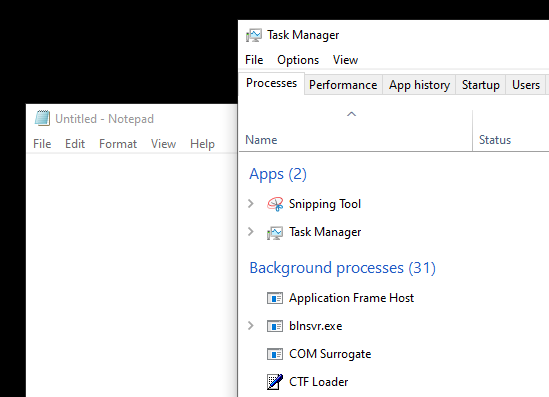

# Hiding processes

the process list is a doubly linked list data structure, which means that each entry has pointers to the previous and the next process in the list. every process in the system has an \_EPROCESS structure associated with it that stores data about the process.

```
0: kd> !process 0 0 notepad.exe
PROCESS ffffa3848e707080
...
```

the links for the previous and next process are contained within the ActiveProcessLinks member of the \_EPROCESS structure.

```
0: kd> dt _EPROCESS ffffa3848e707080
nt!_EPROCESS
   +0x000 Pcb              : _KPROCESS
   +0x438 ProcessLock      : _EX_PUSH_LOCK
   +0x440 UniqueProcessId  : 0x00000000`00000e80 Void
   +0x448 ActiveProcessLinks : _LIST_ENTRY [ 0xfffff807`3661df60 - 0xffffa384`8e7054c8 ]
   ...
```

```
0: kd> dt _LIST_ENTRY (ffffa3848e707080 + 448)
nt!_LIST_ENTRY
 [ 0xfffff807`3661df60 - 0xffffa384`8e7054c8 ]
   +0x000 Flink            : 0xfffff807`3661df60 _LIST_ENTRY [ 0xffffa384`89a98488 - 0xffffa384`8e7074c8 ]
   +0x008 Blink            : 0xffffa384`8e7054c8 _LIST_ENTRY [ 0xffffa384`8e7074c8 - 0xffffa384`8e7064c8 ]
```

to remove a process from this list, we need to change the previous process' Flink to point to next process and the next process' Blink to point to previous process. pseudo-code would look somethng like this

```c
Flink->Blink = Blink
Blink->Flink = Flink
```

let's do that.

```
0: kd> eq (0xfffff807`3661df60 + 8) 0xffffa384`8e7054c8
0: kd> eq 0xffffa384`8e7054c8 0xfffff807`3661df60
```

that's it. if we now open task manager, we see that notepad.exe isn't in the process list.

<figure><figcaption><p>no notepad.exe in task manager</p></figcaption></figure>

## Code

## Resources

[CodeMachine: \_EPROCESS structure explained](https://codemachine.com/articles/kernel\_structures.html#EPROCESS)
